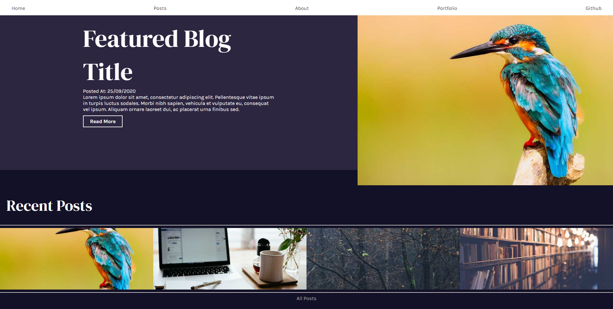

# Gatsby Blog Template project
_Gatsby blog template reading mdx files with graphql_

[live demo]()
## Summary
This is a gatsby blog that reads data from markdown via graphql and presents it in a blog format. 

master branch- Reads MDX data with table of content in blogs
Markdown-Remark branch- reads markdown data
JSON-data branch- reads JSON data 
## Table of Content

## Parts of the site
### Home page

#### Featured blog
Displays the most recent blog post and the text snippet on load. When you click on a recent post the featured post will change to that post and give you a brief description of what the post is about. 
#### Recent Posts
collects the 4 most recent blog posts and displays them. When hovered over displays date
### List of blogs

List all blog posts to /posts divided up into multiple pages. I use
gatsby list pagination to split the list of into multiple pages easily and reduce amount of the data
### Blog Post

Blog posts pages are created in the gatsby config files at launch by getting all slugs and creating each pages with them. when you click on a blog post the site locates the information by querying with graphql the filesystem for a mdx file with the same slug

The page grabs the MDX data matching with the matching slug using graphql and displays the information on to the site.

#### Table of content
Reads the headers id and presents a table out of them. The table headers gets highlighted when the blog header is present on the screen to make it more interactive and visualy appealing

## Whats is used in this project
* Javascript
* React 
* Gatsby
* Graphql 

### Features
* PWA
* blog post arent hard coded and comes from mdx files
### plugins
    gatsby-plugin-offline,
    gatsby-plugin-react-helmet,
    gatsby-transformer-sharp,
    gatsby-plugin-sharp,
    gatsby-plugin-sass,
    gatsby-plugin-html-attributes,
    gatsby-plugin-mdx,
    gatsby-remark-autolink-headers,
    gatsby-remark-slug,
    gatsby-plugin-page-creator,

## Installation
1. git clone/ download files
2. npm install
3. gatsby develop

## Issues I had

## improvements